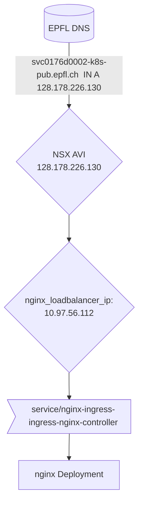
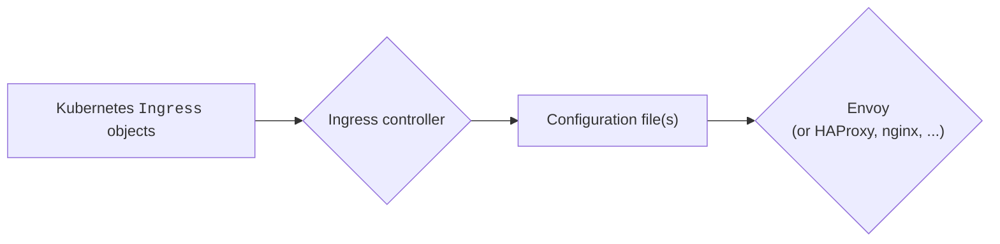

# `xaas-ingress` Ansible role

This role sets up the **ingress controller** of `svc0176idevfsdkt0001`, the ISAS-FSD test cluster on DSI-TKGI.

## Why nginx? (And What is an Ingress Controller Anyway?)

A standard DSI-TKGI cluster comes with [contour](https://projectcontour.io) installed as the out-of-the-box **ingress controller**:

This choice, decided between Camptocamp and ITOP-SDDC for lack of a suitable, working solution from the vendor, has several drawbacks for us:

- We want cache-as-a-service for “big” apps (e.g. WordPress), and authentication-as-a-service for “small” ones (e.g. some kind of Web dashboard that doesn't do Tequila, yet should only be visible by a restricted audience)
- During our preliminary tests, creating a very simple invalid `Ingress` object resulted in both Envoy pods crashing — Hardly a situation where one would feel comfortable handing the keys to a namespace to one of our apprentices!

## Helm

Nginx is packaged as the so-called [ingress-nginx Helm chart](https://docs.nginx.com/nginx-ingress-controller/installation/installation-with-helm/), which one installs using the `helm` version 3 tool, or (in our case) its [Ansible wrapper](https://docs.ansible.com/ansible/latest/collections/kubernetes/core/helm_module.html#ansible-collections-kubernetes-core-helm-module).

Helm is a cloud-native package manager. In plain English, it means that it does the same thing as Ansible, but with less flexibility ☺; also, it insists on [storing state in Kubernetes (as Secrets)](https://banzaicloud.com/blog/helm3-the-good-the-bad-and-the-ugly/#secrets-as-the-default-storage-driver).

## EPFL-specific Hurdles

Because DevOps teams are not granted permissions to create “expensive” objects (such as Services of `type: LoadBalancer`, that allocate IPAM inside NSX); and because the “defenses” that enforce that restriction occupy more “territory” of their own (more on that below); Ansible cannot currently be used to
- delete useless namespaces (such as the whole `projectcontour`),
- create new ones (`nginx-ingress`, whose poorly-chosen name we decided to keep for the reason that follows:)

These operations must currently be performed “in day 2” by clicking inside portal-xaas.epfl.ch. This might change in the future with a better implementation of the aforementioned “defenses” (i.e. when ITOP-SDDC deploys an [admission controller](https://kubernetes.io/docs/reference/access-authn-authz/admission-controllers/), rather than the current approach which is based on locking down namespaces with RBAC and `Quota` before handing them over to DevOps teams).

Owing to the same permission restrictions mentioned above, there are changes that the nginx Helm chart wants to do, but can't, such as:
- altering `ClusterRole` objects in the pre-install hook
- setting up admission webhooks

Fortunately, the nginx Helm chart offers suitable configuration options (`helm --set` / `kubernetes.core.helm` → `values`) to side-step these concerns.

And finally, the EPFL security team frowns upon
- running pods as the root user
- ~~binding on reserved ports~~This has now been fixed by granting `CAP_NET_BIND_SERVICE` at will

... but the Helm chart offers a suitable workaround for the first of these points as well.
